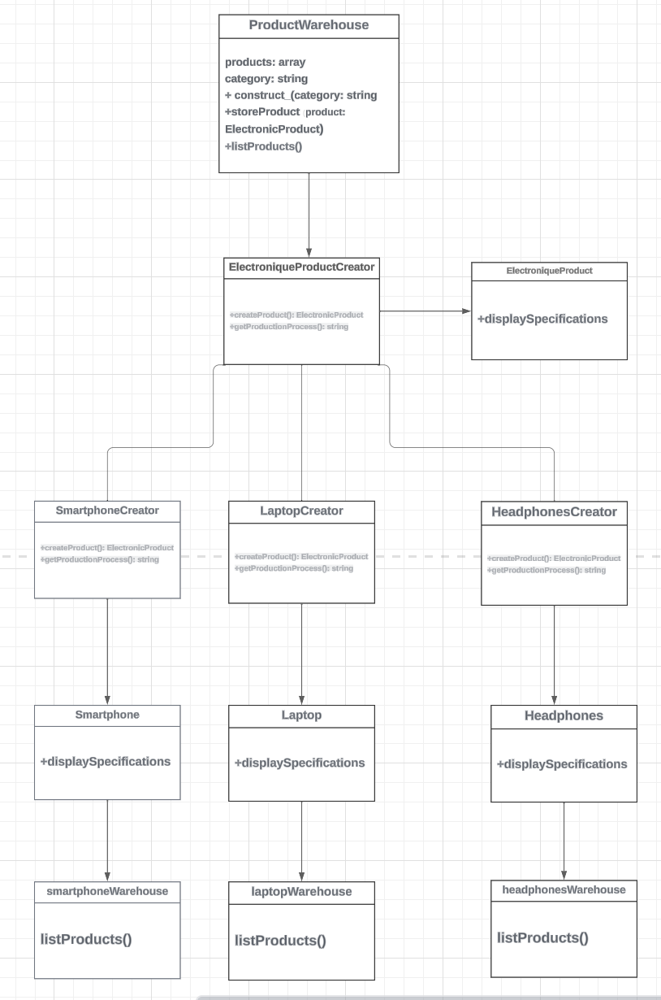

# [Design Patern - Factory]

## Table des matières
1. [Réponses aux questions](#réponses-aux-questions)
2. [Design Pattern: {Factory}](#design-pattern-Factory)
   - [Contexte](#contexte)
   - [Avantages/Inconvénients](#avantagesinconvénients)
   - [Implémenter le design pattern](#implementer-le-design-pattern)
   - [Diagramme de classes UML](#diagramme-de-classes-uml)
   - [Lancer le Projet](#lancer-le-projet)
3. [Code Source de la Démo](#code-source-de-la-démo)

## Réponses aux questions
1 - En programmant vers une interface, cela permet à nos classes d'interagir de manière générique, facilitant ainsi le remplacement ou l'ajout de nouvelles implémentations sans impacter le reste du code. Cela rend le code plus flexible et extensible.
En utilisant des interfaces, on favorise la séparation des préoccupations. Chaque classe peut se concentrer sur son rôle spécifique, ce qui rend le code plus modulaire et plus facile à comprendre.
et cela réduit les dépendances directes entre les classes. Cela rend le système moins couplé, facilitant ainsi la maintenance et la modification du code sans impacter l'ensemble du système.

exemple code:
```php
<?php
// Interface
interface Messenger {
    public function sendMessage($content);
}

// Implémentation concrète
class EmailMessenger implements Messenger {
    public function sendMessage($content) {
        echo "Sending email: $content\n";
    }
}

// Client utilisant une interface
class Notifier {
    private $messenger;

    public function __construct(Messenger $messenger) {
        $this->messenger = $messenger;
    }

    public function notifyUser($message) {
        $this->messenger->sendMessage($message);
    }
}

// Utilisation
$emailMessenger = new EmailMessenger();
$notifier = new Notifier($emailMessenger);
$notifier->notifyUser("Hello, this is a notification.");
?>


2 - il mieux préférer la composition à l’héritage car,  La composition permet de construire des objets en agrégeant d'autres objets, offrant une plus grande flexibilité pour changer ou étendre le comportement. Vous pouvez facilement ajouter ou supprimer des fonctionnalités en modifiant la composition, sans toucher à la hiérarchie de l'héritage.

exemple de code:
Dans cet exemple, la classe Car utilise la composition en incorporant un objet Engine. Cela permet de changer le type de moteur (par exemple, passer d'un moteur électrique à un moteur à essence) sans modifier la hiérarchie d'héritage, ce qui rend le code plus flexible.


<?php
// Interface ou classe abstraite représentant une fonctionnalité
interface Engine {
    public function start();
}

// Implémentation concrète de la fonctionnalité
class ElectricEngine implements Engine {
    public function start() {
        echo "Electric Engine started.\n";
    }
}

// Classe principale utilisant la composition
class Car {
    private $engine;

    public function __construct(Engine $engine) {
        $this->engine = $engine;
    }

    public function start() {
        echo "Car starting...\n";
        $this->engine->start();
    }
}

// Utilisation
$electricEngine = new ElectricEngine();
$car = new Car($electricEngine);
$car->start();


3 - Les interfaces permettent de déclarer un ensemble de méthodes que plusieurs classes peuvent partager, sans imposer une hiérarchie d'héritage. Cela favorise la flexibilité, la modularité et le polymorphisme dans le code.


## Design Pattern: {Factory}

### Contexte
Situation Initiale: 
Un système de gestion de production, pour une entreprise qui fabrique des dispositifs électroniques grand public. L'entreprise propose une gamme de produits comprenant des smartphones, des ordinateurs portables et des écouteurs. Chaque type de produit a des spécifications uniques, des étapes de production spécifiques et doit être stocké dans des entrepôts distincts.
Au départ, l'entreprise ne dispose pas d'une manière efficace de gérer la création des produits et de stocker les informations spécifiques à chaque type de produit. Le processus de création des produits est disséminé dans le code principal de l'application, ce qui rend difficile l'ajout de nouveaux types de produits sans perturber le code existant. De plus, les informations spécifiques à chaque type de produit ne sont pas encapsulées de manière adéquate.

### Avantages/Inconvénients
Avantages : 
- Extensibilité: L'entreprise souhaite ajouter de nouveaux types de produits à sa gamme sans perturber le code existant. Le Factory Method Pattern permettra d'ajouter facilement de nouvelles catégories de produits en étendant les créateurs existants.

- Encapsulation: Chaque créateur (par exemple: SmartphoneCreator, LaptopCreator, HeadphonesCreator) encapsule la logique de création spécifique à chaque type de produit, assurant une meilleure organisation du code.

- L'utilisation du Factory Method Pattern permettrait à l'entreprise de gérer efficacement la création des produits et d'ajouter de nouveaux types de produits à l'avenir.

Inconvénients :
Complexité accrue : L'introduction du pattern Factory peut introduire une complexité supplémentaire, en particulier pour des systèmes plus simples où la création d'objets n'est pas très complexe.

Code supplémentaire : L'implémentation du pattern Factory nécessite généralement plus de code que l'approche directe de création d'objets.

Difficulté à comprendre pour les novices : Pour les développeurs non familiers avec le pattern Factory, le code peut sembler complexe au premier abord. Cela peut rendre la maintenance difficile pour les membres de l'équipe qui ne sont pas familiarisés avec le pattern.

### Implémenter le design pattern
Mon exemple de code se trouve dans: index.php

### Diagramme de classes UML


### Lancer le Projet
1. Le programme s'execute en php
2. Exécuter le code dans le terminal du projet: php script.php


### Code Source de la Démo:

<?php
// Interface de produit électronique
interface ElectronicProduct {
    public function displaySpecifications();
}

// Implémentation concrète de ElectronicProduct pour les smartphones
class Smartphone implements ElectronicProduct {
    public function displaySpecifications() {
        echo "Smartphone : écran de 6 pouces, configuration double caméra\n";
    }
}

// Implémentation concrète de ElectronicProduct pour les ordinateurs portables
class Laptop implements ElectronicProduct {
    public function displaySpecifications() {
        echo "Ordinateur portable : écran de 15 pouces, 8 Go de RAM, SSD de 512 Go\n";
    }
}

// Implémentation concrète de ElectronicProduct pour les écouteurs
class Headphones implements ElectronicProduct {
    public function displaySpecifications() {
        echo "Écouteurs : design circum-auriculaire, annulation de bruit\n";
    }
}

// Interface de créateur de produit électronique
interface ElectronicProductCreator {
    public function createProduct(): ElectronicProduct;
    public function getProductionProcess(): string;
}

// Implémentation concrète de ElectronicProductCreator pour les smartphones
class SmartphoneCreator implements ElectronicProductCreator {
    public function createProduct(): ElectronicProduct {
        return new Smartphone();
    }

    public function getProductionProcess(): string {
        return "Production de smartphones : Assemblage des composants, test des fonctionnalités\n";
    }
}

// Implémentation concrète de ElectronicProductCreator pour les ordinateurs portables
class LaptopCreator implements ElectronicProductCreator {
    public function createProduct(): ElectronicProduct {
        return new Laptop();
    }

    public function getProductionProcess(): string {
        return "Production d'ordinateurs portables : Assemblage du matériel, installation du logiciel\n";
    }
}

// Implémentation concrète de ElectronicProductCreator pour les écouteurs
class HeadphonesCreator implements ElectronicProductCreator {
    public function createProduct(): ElectronicProduct {
        return new Headphones();
    }

    public function getProductionProcess(): string {
        return "Production d'écouteurs : Assemblage des pièces, contrôle qualité\n";
    }
}

// Entrepôt pour stocker les produits
class ProductWarehouse {
    private $products = [];
    private $category;

    public function __construct($category) {
        $this->category = $category;
    }

    public function storeProduct(ElectronicProduct $product) {
        $this->products[] = $product;
        echo "Produit stocké dans l'entrepôt: {$this->category} \n";
    }

    public function listProducts() {
        echo "Produits stockés dans l'entrepôt {$this->category}: " . count($this->products) . "\n";
        foreach ($this->products as $product) {
            echo "- ";
            $product->displaySpecifications();
        }
        echo "\n";
    }
}

// Code client
function displayProductInformation(ElectronicProductCreator $creator, ProductWarehouse $warehouse, $number = 1) {
    for ($i = 1; $i <= $number; $i++) {
        $product = $creator->createProduct();
        $productionProcess = $creator->getProductionProcess();

        echo "Processus de production :\n$productionProcess";
        echo "Spécifications :\n";
        $product->displaySpecifications();

        // Stocker le produit dans l'entrepôt spécifique
        $warehouse->storeProduct($product);
    }
}

// Tester le code
$smartphoneWarehouse = new ProductWarehouse("Smartphone Factory");
$laptopWarehouse = new ProductWarehouse("Laptop Factory");
$headphonesWarehouse = new ProductWarehouse("Headphones Factory");

// Produire et stocker 4 smartphones
displayProductInformation(new SmartphoneCreator(), $smartphoneWarehouse, 4);
// Produire et stocker 3 ordinateurs portables
displayProductInformation(new LaptopCreator(), $laptopWarehouse, 3);
// Produire et stocker 2 écouteurs
displayProductInformation(new HeadphonesCreator(), $headphonesWarehouse, 2);

// Afficher les produits dans les entrepôts spécifiques
$smartphoneWarehouse->listProducts();
$laptopWarehouse->listProducts();
$headphonesWarehouse->listProducts();# Dp-Factory

\```
